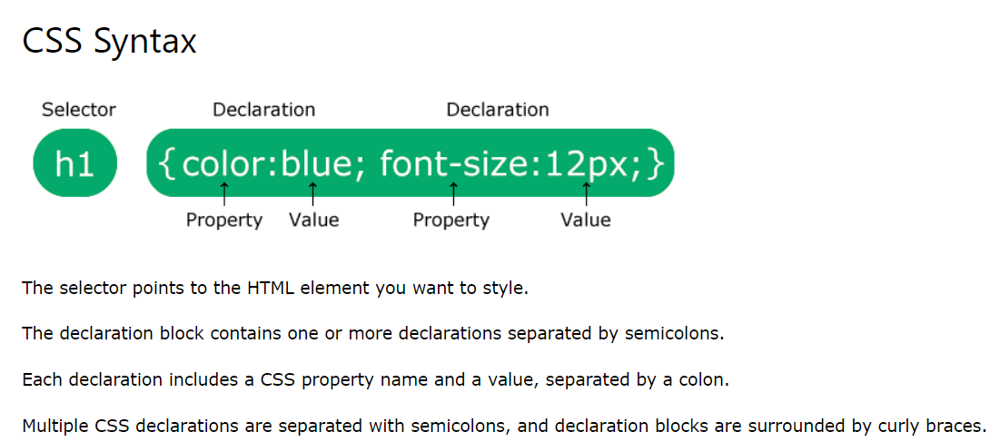
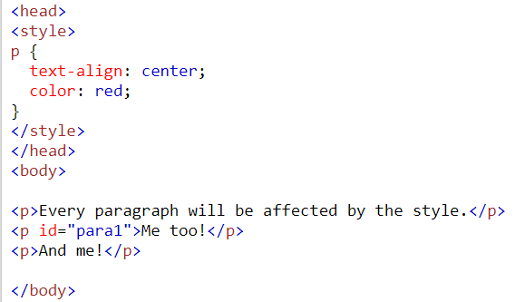
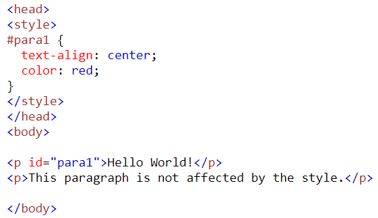
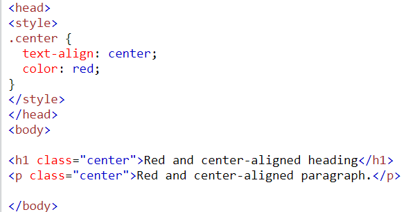
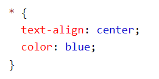
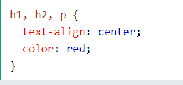

## CSS Syntax  

  


#### since we are modifying paragraph we are using  `<p>` tag , we can do the same by using class and id values ( .name , #name resp.)  

### Css element selector  

  

### Css id selector  

  

### Css class selector  

  

### Css universal selector  

  

### Css grouping selector  

  

### NOTE  

- The descendant selector matches all elements that are descendants of a specified element. `<p>` elements inside `<div>` elements   (space)  
- The child selector selects all elements that are the children of a specified element. `<p>` elements that are children of a `<div>` elements ,descendand are not included (>)  
- The adjacent sibling selector is used to select an element that is directly after another specific element.first `<p>` element that are placed immediately after `<div>` elements  (+)
- A pseudo-class is used to define a special state of an element.  
    - Style an element when a user mouses over it
    - Style visited and unvisited links differently
    - Style an element when it gets focus  
```css
    selector:pseudo-class {
  property: value;
}
```  

```css
   
/* unvisited link */
a:link {
  color: #FF0000;
}

/* visited link */
a:visited {
  color: #00FF00;
}

/* mouse over link */
a:hover {
  color: #FF00FF;
}

/* selected link */
a:active {
  color: #0000FF;
} 


```  

```css
a.highlight:hover {
  color: #ff0000;
}

div:hover {
  background-color: blue;
}
```
- The :first-child pseudo-class matches a specified element that is the first child of another element. 
```css
    Match the first <i> element in all <p> elements 
    p i:first-child {
    color: blue;
}

```